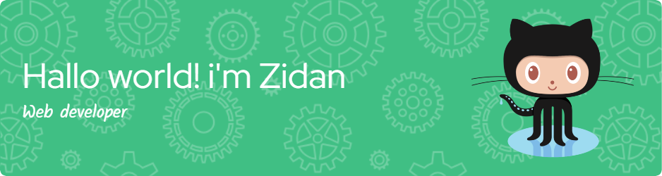

# 💫 About Me:
- 🔭 Saya sedang belajar web di **codepolitan** - 🌱 Saya sedan mendalami **Javascript**

# 💻 Tech Stack:
    
# 📊 GitHub Stats:
 
 

### ✍️ Random Dev Quote

<!-- Proudly created with GPRM ( https://gprm.itsvg.in ) -->
<picture>
  <source media="(prefers-color-scheme: light)" srcset="https://raw.githubusercontent.com/lookatthemoo/lookatthemoo/output/pacman-contribution-graph-dark.svg">
  <source media="(prefers-color-scheme: dark)" srcset="https://raw.githubusercontent.com/lookatthemoo/lookatthemoo/output/pacman-contribution-graph.svg">
  
</picture>

###
